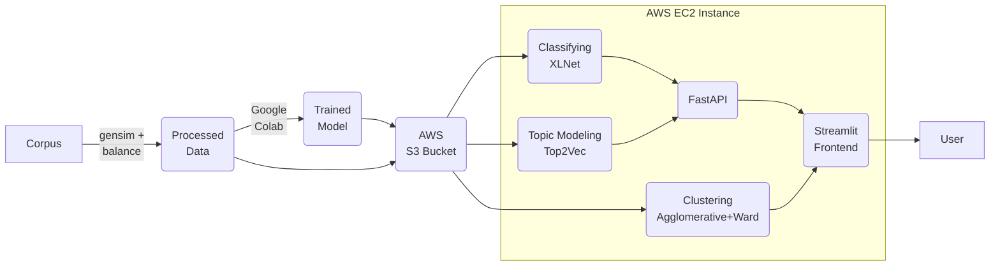

# noobrainer

This here is a repo for our MLE capstone project at [fourthbrain.ai](https://www.fourthbrain.ai/), cohort 6. The domain we have chosen is Natural Language Processing, specifically Automated Metadata Tagging and Topic Modeling.

## The Problem

Imagine a helpdesk system with only 2 input text boxes: Title and Description. What can we learn from what people type into them? Is it possible to analyze the stored texts and come up with important terms and keywords? How about rare terms and topics? Or even "novelty"? Can we discover any underlying pattern of requests over time? Is it possible to cluster these topics into a user-specified number of groups? Can we train a supervised model to predict the subject matter experts who will handle a request, up to a desired level of accuracy? Can we seed the groups with some user-specified keywords? And if we can, is it possible to perform hierarchical clustering on these groups?

## This Solution

We only had about _4 weeks_ to work on this (!), so deciding which features to implement was a bit of a challenge. In the end, this is what we made.



<details><summary>Show/hide</summary>

### Data

For training data, we used the [2.7M news/articles](https://components.one/datasets/all-the-news-2-news-articles-dataset/) corpus. We decided to split the data into only 3 categories for the proof-of-concept demo: `health`, `tech`, and `other`. We found that using only 60K of the article titles from the corpus, removing imbalance, was sufficient to train our models. Yay data-centric!

### Model

We implemented 3 different models:
1. Topic Modeling using [Top2Vec](https://github.com/ddangelov/Top2Vec). This part tries to answer questions about what the important topics are, and their related keywords, and how to group them. We called this model `tomo`.
1. Classification using [XLNet](https://huggingface.co/docs/transformers/model_doc/xlnet), specifically [XLNetForSequenceClassification](https://huggingface.co/docs/transformers/model_doc/xlnet#transformers.XLNetForSequenceClassification). This part tries to answer questions about how to best classify the requests, in order to route them to the subject matter experts that can handle them. We called this model `ner`.
1. [AgglomerativeClustering](https://scikit-learn.org/stable/modules/generated/sklearn.cluster.AgglomerativeClustering.html). This part tries to find patterns in the request texts over time, and perform hierarchical clustering on the results. We called this model `clustr`.

### Training

We used [Google Colab](https://colab.research.google.com/) to train our models.
- Topic Modeling: [train.py](utils/train.py). Also see [Week13_02.Top2Vec Explorations.ipynb](apps\old\prelim\Dev_Jus\Week13_02.Top2Vec%20dExplorations.ipynb)
- Classifying: [0_NER_XLNet_model_final_balanced.ipynb](models/0_NER_XLNet_model_final_balanced.ipynb)
- Clustering: [clustr.py](utils/clustr.py). Also see [2_4bcapstone_glg_clustering_BryanKim_v4_1.ipynb](apps\old\prelim\Dev_Bryan\2_4bcapstone_glg_clustering_BryanKim_v4_1.ipynb)

### Deployment

The models were deployed on an AWS EC2 instance:
- Image type: `Deep Learning AMI (Ubuntu 18.04) Version 60.2`
- Instance type: `g4dn.2xlarge` (Note: We tried using `g4ad` instances and had trouble getting it to work with the GPU)

### Future Work

- Incorporate [Model Cards](https://arxiv.org/abs/1810.03993) and [Data Cards](https://dl.acm.org/doi/10.1145/3458723) into the training process. Automate the process so that the cards become the input parameters at the start of training, and the `About this model` section is generated at the end of training.
- Named Entity Recognition. Discover named entities from requests and try to automatically generate a taxonomy for them. Further use the taxonomy to create an ontology/knowledge graph.
- Divide the app into 2 logical parts:
    - Historical reporting and analyses of past requests.
    - Exploring and augmenting the models with newly discovered entities/topics.
- Connect the output of one model to the input of another for semi-supervised learning. E.g. what topics are discovered --> which named entities belong to which topics --> are they still relevant today? Vice versa.
- Visualize how the clusters "evolve" over time. E.g. use a sliding window of time-intervals and plot dendrograms/heatmaps for each interval, and provide a slider to examine the steps.

</details>

## In this repo

- [app.py](app.py): The main front end Streamlit app.
- [cloud-init.sh](cloud-init.sh): The Cloud-init script that runs on the EC2 instance.
- [main.py](main.py): The main backend FastAPI app.
- [apps](apps): Components of the front end app.
    - [old](apps/old): Old versions and iterations of the app, plus other stuff.
    - [new](apps/new): We were experimenting with docker compose for deployment, but didn't have time to finish it.
- [data](data): Put data files and preprocessing scripts here.
- [docs](docs): Documentation etc.
- [models](models): Put model files, API schema, and training scripts here.
- [utils](utils): Utility scripts.

## Usage

### On your local machine

<details><summary>Show/hide</summary>

### 1. Minimum requirements

- 16G of RAM
- [CUDA enabled GPU](https://developer.nvidia.com/cuda-gpus) with at least 4GB of memory
- Ubuntu 18.04 LTS
- Python 3.8

### 2. Clone this repo

```bash
git clone https://github.com/juswaldy/noobrainer.git
cd noobrainer
```

### 3. Install requirements in a conda environment

```bash
conda create -n noobrainer python=3.8
source activate noobrainer
pip install --no-cache-dir -r requirements.txt
```

### 4. Prepare data and train the models

Download the corpus from [here](https://components.one/datasets/all-the-news-2-news-articles-dataset/), and prepare it using the notebook [1. Preprocess using gensim simple_preprocess.ipynb](data/1.%20dPreprocess%20dusing%20dgensim%20dsimple_preprocess.ipynb).

Train the XLNet Classification model using [0_NER_XLNet_model_final_balanced.ipynb](models/0_NER_XLNet_model_final_balanced.ipynb), and save the results in the `models` folder.

Train the Top2Vec Topic Modeling using the [train.py](models/train.py) script. For example, to train on the 60k titles only, run:

```bash
python models/train.py --fn tomo --action train --modelname doc2vec --trainfile data/news2.7m-gensim-titles.60k.csv --outputfile models/tomo-60k.pkl
```

### 5. Start up the API server and the frontend

```bash
# Uvicorn on default port 8000.
nohup uvicorn --host 0.0.0.0 --port 8000 --reload main:app &

# Streamlit on default port 8501.
nohup streamlit run app.py &
```

The API server is running on port `8000`. The frontend is running on port `8501`.

</details>

### On AWS EC2

This is how we deployed our first demo version and published it.

<details><summary>Show/hide</summary>

### 1. Create an EC2 instance and ssh into it

- Choose image type: `Deep Learning AMI (Ubuntu 18.04) Version 60.2`
- Choose instance type: `g4dn.*`. The one we use for the demo is `g4dn.2xlarge`, but any size >= `large` should work fine. Note: We tried using `g4ad` instances and had trouble getting it to work with the GPU
- Copy its public ip dns to clipboard
- ssh into it

### 2. Clone this repo

```bash
git clone https://github.com/juswaldy/noobrainer.git
cd noobrainer
```

### 3. Activate GPU environment and install requirements

```bash
source activate tensorflow2_p38
pip install --no-cache-dir -r requirements.txt
```

### 4. Configure AWS command line interface and download models and data from s3

```bash
aws configure
aws s3 cp s3://noobrainer/models/ner-healthtechother-titles-23.pkl ./models/ner-healthtechother-titles-23.pkl
aws s3 cp s3://noobrainer/models/tomo-60k.pkl ./models/tomo-60k.pkl
aws s3 cp s3://noobrainer/models/tomo-all-87k-articles-single-21.pkl ./models/tomo-healthtech-articles-single-17.pkl
aws s3 cp s3://noobrainer/models/tomo-healthtech-titles-single-17.pkl ./models/tomo-healthtech-titles-single-17.pkl
aws s3 cp s3://noobrainer/models/tomo-healthtech-articles-single-17.pkl ./models/tomo-healthtech-articles-single-17.pkl
aws s3 cp s3://noobrainer/data/health_tech_time.csv ./data/health_tech_time.csv
aws s3 cp s3://noobrainer/data/0_combined_set_60k_date.csv ./data/0_combined_set_60k_date.csv
```

### 5. Start up the API server and the frontend

```bash
# Uvicorn on default port 8000.
nohup uvicorn --host 0.0.0.0 --port 8000 --reload main:app &

# Streamlit on default port 8501.
nohup streamlit run app.py &
```

Don't forget to stop the instance when you're not using it anymore.

</details>


## Shoutouts

- [Fourthbrain.ai](https://www.fourthbrain.ai/) staff especially Bruno Janota!
- LDA Topic Models [video](https://www.youtube.com/watch?v=3mHy4OSyRf0) by Andrius Knispelis!
- [Top2Vec](https://github.com/ddangelov/Top2Vec) and [RESTful-Top2Vec](https://github.com/ddangelov/RESTful-Top2Vec) by Dimo Angelov!
- [fastapi](https://fastapi.tiangolo.com/) by Sebastián Ramírez!
- [streamlit](https://streamlit.io/) by Streamlit!
- [python-stat-tools](https://github.com/harmkenn/python-stat-tools) by Ken Harmon!
- [st-click-detector](https://github.com/vivien000/st-click-detector) by Vivien Tran-Thien!
- University of South Florida [ClipArt ETC](https://etc.usf.edu/clipart/)!
