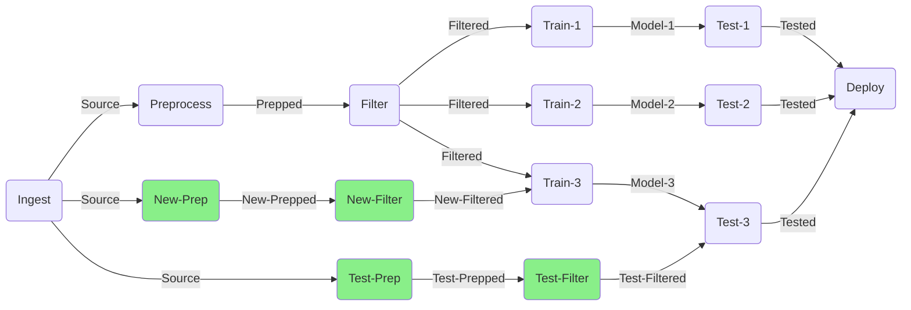
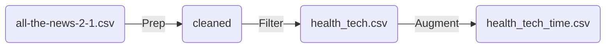
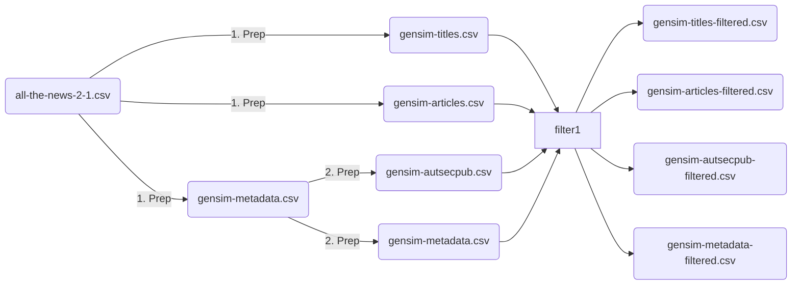
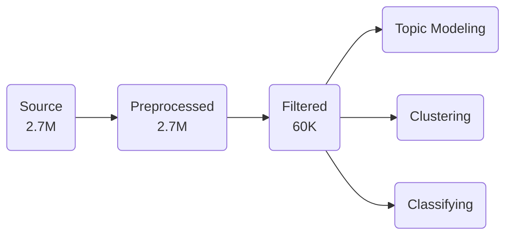
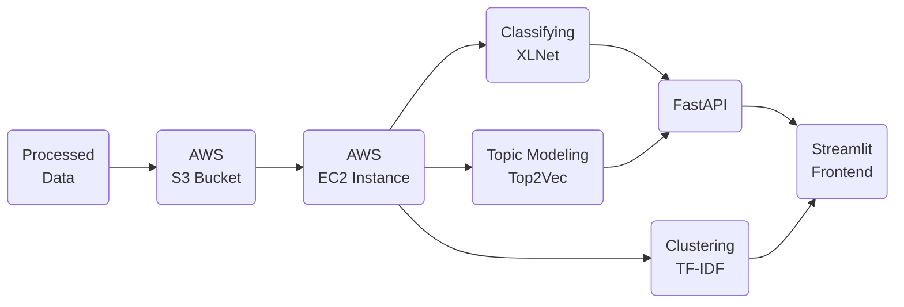

# noobrainer History


## Slack Tue 10 May 2022


OK yeah sure! Then I'll just call it
- nobrainer, yeah why not
- noobrainer, Noob Brain NER
- noobRainer, Noob `R` AI NER
	- Not the `R` language
	- Not `Rainer`
	- The `R` is a smart-ass logo combination of `L` and `P` because `L`anguage `P`rocessing
	- If you accept that, then the name would stand for `Noob Language Processing AI Noob Extra Language Processor`
	- Interesting that you can move `Extra` to any position in the name
	- The `L` and `P` could also stand for our upcoming accuracy-killer library `P`sychic `L`earn (note: it will not have killer-accuracy)
	- Also the Noob part is a smart-ass version of "Am I such a noob?! I even spelled `no` in `nobrainer` wrong!"

Something like this? But more smart-ass of course! :p


## Chat Wed 11 May

1. Detect objects in sentence
2. Top 10 request topics weekly


## Musings Thu 12 May

It would be nice if we can have a pipeline that separates each phase of the process. That way we can have several versions of the prepped data, filtered data, training data, etc which we can trace back to the original source. So at each stage we can compare and analyze and branch off if needed.





## Work Fri 13 May

1. Explore temporal aspects
2. Augment dataset with time columns and save as `health_tech_time.csv`

### To reach a `pip freeze`

```bash
conda create -n noobrainer python=3.7 pip
conda activate noobrainer
pip install top2vec
pip install top2vec[sentence_encoders]
pip install spacy
pip install nltk
pip install matplotlib
pip install seaborn
pip install mpld3
pip install fastapi
pip install uvicorn
pip install streamlit
```


## Work Sun 15 May

1. Create an api testing notebook
2. Make streamlit talk to the api
3. Show wordclouds on topic modeling
4. Make docker image and deploy on ec2
5. Start working on docker compose


## Meeting Mon 16 May

Attendee: Bryan, Jus.

1. Introduce the framework to Bryan
2. Discuss MVP
3. Start porting the clustering portion to Streamlit
4. Test a bunch of stuff


## Work Tue 17 May

1. Train tomo on titles `health_tech_time.csv`
1. Make `frontend` and `backend` folders for docker-compose, but move everything to root folder for a single Docker image. Currently we need to load the `clustr` and `ner` models on the `frontend`, `tomo` on the `backend`
1. Create `/model/refresh` endpoint for switching models
1. Work with Bryan on bringing up the dendrogram plots
1. Check in interim stuff into `final` and merge into `main`


## Work Wed 18 May

1. Use `gensim.utils.simple_preprocess` to preprocess source
1. Session with Daniel and Bryan
1. Finish exposing all clustering plots
1. Update clustering to use date range


### Before



### After




### Test queries/reports

People with pancreatic ductal adenocarcinoma (PDAC) are six times more likely to have had gallstones the year before their diagnosis than people without this type of cancer In a new study, researchers say their findings indicate that gallstones could be a warning sign for the aggressive and often deadly form of cancer. The study will be presented this weekend at the Digestive Disease Week 2022 meeting in San Diego. The research hasn’t been peer-reviewed or published yet. PDAC is the most common form of pancreatic cancer, accounting for more than 90 percent of cases. It often is fatal because it tends to be diagnosed in later stages.


## Work Thu 19 May

1. Make clickable wordclouds
1. Make new cleaned files

### API/Backend

```bash
conda create -n noobrainer_backend python=3.7 pip
conda activate noobrainer_backend
pip install top2vec
pip install fastapi
pip install uvicorn
pip freeze > requirements.txt
```

### Frontend

```bash
conda create -n noobrainer_frontend python=3.7 pip
conda activate noobrainer_frontend
pip install spacy
pip install nltk
pip install matplotlib
pip install seaborn
pip install mpld3
pip install streamlit
pip freeze > requirements.txt
```

### Training

```bash
conda create -n noobrainer_training python=3.7 pip
conda activate noobrainer_training
pip install top2vec
pip install tensorflow-text==2.8.1
pip install spacy
pip install nltk
pip freeze > requirements.txt
```

### S3

Copy up to S3.

```bash
aws s3 cp ./models/ s3://noobrainer/models/ --recursive
aws s3 cp ./data/ s3://noobrainer/data/ --recursive
```


### EC2

```bash
docker build -f ./new/backend/Dockerfile -t noobrainer/backend:latest .
docker run -it --gpus all --rm -v /home/ubuntu/models:/app/models -p 8000:8000 noobrainer/backend:latest
```

```bash
aws s3 cp s3://noobrainer/models ./models --recursive
aws s3 cp s3://noobrainer/data/health_tech_time.csv ./data/health_tech_time.csv
```

Access directly from S3

```bash
import boto3
import pandas as pd

s3 = boto3.client('s3')
obj = s3.get_object(Bucket='noobrainer', Key='data/small-articles-single.csv')
df = pd.read_csv(obj['Body'])
print(df.describe())
```

```
sub_corpus = sample[(sample[label].str.contains('|'.join(subset_cat)) == False) & (sample[label].str.contains('|'.join(["Your search terms"])))]\
[['year','month','day','section_clean','title_clean', 'article_clean']]
```

## Work Fri 20 May

### Script for demo

```bash
# Create ec2 instance, copy its public <ip4> address to clipboard.
z.sh ec2 ssh <ip4>
git clone https://github.com/juswaldy/noobrainer.git
cd noobrainer
conda create -n noobrainer python=3.7.13 pip
conda activate noobrainer
pip install --no-cache-dir -r requirements.txt
aws configure
aws s3 cp s3://noobrainer/models ./models --recursive
aws s3 cp s3://noobrainer/data/0_combined_set_60k_date.csv ./data/0_combined_set_60k_date.csv
nohup uvicorn --host 0.0.0.0 --port 8000 --reload main:app &
# Update app.py "About" to use the public ip address.
streamlit run app.py
```

1. Train tomo on the whole new prepped data
1. Apply some metrics to the trained tomo models
1. "Similarity per month over the past 2 years"
1. The Common, the Rare, and the Novelty

## Work Sun 22 May

### Standing up NER

```bash
pip install torch
pip install transformers
pip install sentencepiece
```

## Work Mon 23 May

```
Some weights of the model checkpoint at xlnet-base-cased were not used when initializing XLNetForSequenceClassification: ['lm_loss.bias', 'lm_loss.weight']
- This IS expected if you are initializing XLNetForSequenceClassification from the checkpoint of a model trained on another task or with another architecture (e.g. initializing a BertForSequenceClassification model from a BertForPreTraining model).
- This IS NOT expected if you are initializing XLNetForSequenceClassification from the checkpoint of a model that you expect to be exactly identical (initializing a BertForSequenceClassification model from a BertForSequenceClassification model).
Some weights of XLNetForSequenceClassification were not initialized from the model checkpoint at xlnet-base-cased and are newly initialized: ['logits_proj.bias', 'logits_proj.weight', 'sequence_summary.summary.weight', 'sequence_summary.summary.bias']
You should probably TRAIN this model on a down-stream task to be able to use it for predictions and inference.
```


```python
model = XLNetForSequenceClassification.from_pretrained("xlnet-base-cased", num_labels=3)
model.cuda()
```


| Command                                                      | Error                                                        |
| ------------------------------------------------------------ | ------------------------------------------------------------ |
| `model = torch.load('models/blah3.pt')`                      | Traceback (most recent call last):<br/>  File "ner.py", line 105, in <module><br/>    model.eval()<br/>AttributeError: 'collections.OrderedDict' object has no attribute 'eval' |
| `model = model.load_state_dict(torch.load('models/blah3.pt'))` | Traceback (most recent call last):<br/>  File "ner.py", line 106, in <module><br/>    model.eval()<br/>AttributeError: '_IncompatibleKeys' object has no attribute 'eval' |


### Standing up the API

```bash
# Create ec2 instance, choose image "Deep Learning AMI (Ubuntu 18.04) Version 60.2", type "g4dn.2xlarge".
# Copy its public <ip4> address to clipboard, and ssh to it.
git clone https://github.com/juswaldy/noobrainer.git
# Update app.py "About" to use the public <ip4> address.
cd noobrainer
source activate tensorflow2_p38
pip install --no-cache-dir -r requirements.txt
pip install torch
pip install transformers
pip install sentencepiece

aws configure
aws s3 cp s3://noobrainer/models/ner-healthtechother-titles-23.pkl ./models/ner-healthtechother-titles-23.pkl
aws s3 cp s3://noobrainer/models/tomo-60k.pkl ./models/tomo-60k.pkl
aws s3 cp s3://noobrainer/models/tomo-all-87k-articles-single-21.pkl ./models/tomo-healthtech-articles-single-17.pkl
aws s3 cp s3://noobrainer/models/tomo-healthtech-titles-single-17.pkl ./models/tomo-healthtech-titles-single-17.pkl
aws s3 cp s3://noobrainer/models/tomo-healthtech-articles-single-17.pkl ./models/tomo-healthtech-articles-single-17.pkl
aws s3 cp s3://noobrainer/data/health_tech_time.csv ./data/health_tech_time.csv
aws s3 cp s3://noobrainer/data/0_combined_set_60k_date.csv ./data/0_combined_set_60k_date.csv

nohup uvicorn --host 0.0.0.0 --port 8000 --reload main:app &

streamlit run app.py
```

## Demo Tue 24 May

The concept of a topic is hard to grasp because it has at least 2 contradictory meanings. A topic is a very general thing, yet a topic is also a very specific thing. "The weather" is a topic. Yet, "the weather is affected by a phenomenon called global warming, which is directly caused by human activities emitting greenhouse gases, especialy CO2, into the atmosphere, and this causation has been scientifically proven" is also a topic.

When we're discussing a topic, and then a subtopic comes up, we don't call it _subtopic_, but we say, "That's a _topic_ for another day."


## The Deck Wed 25 May






